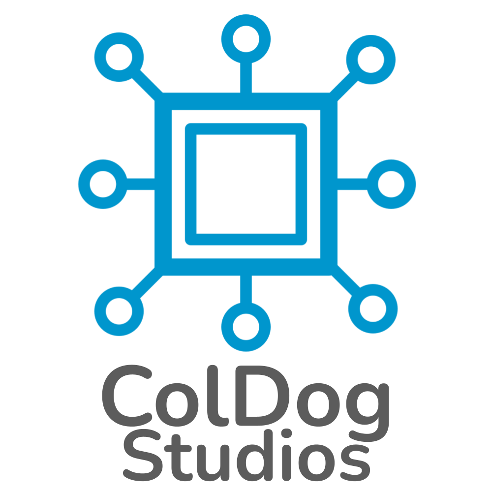

<a name="readme-top"></a>

<!-- PROJECT SHIELDS -->
[![Release][release-shield]][release-url]
[![Downloads][downloads-shield]][downloads-url]
[![Issues][issues-shield]][issues-url]
[![Stargazers][stars-shield]][stars-url]
[![LinkedIn][linkedin-shield]][linkedin-url]

<!-- PROJECT LOGO -->
<br>
<div align="center">
  <a href="https://github.com/ColDogStudios/template-repo">
    
  </a>

  <p align="center">
    <br>
    <em>Copyright © ColDog Studios. All rights reserved.</em>
    <br>
    <br>
    <a href="https://github.com/ColDogStudios/template-repo/tree/CDS/docs"><strong>Explore the docs »</strong></a>
    <br>
    <br>
    <a href="https://github.com/ColDogStudios/template-repo/issues/new?assignees=&labels=type%3A+question&template=ask_a_question.yml&title=%5BQuestion%5D%3A+">Ask a Question</a>
    ·
    <a href="https://github.com/ColDogStudios/template-repo/issues/new?assignees=&labels=type%3A+bug&template=bug_report.yml&title=%5BBug%5D%3A+">Report Bug</a>
    ·
    <a href="https://github.com/ColDogStudios/template-repo/issues/new?assignees=&labels=type%3A+feature&template=feature_request.yml&title=%5BFeature+Request%5D%3A+">Request Feature</a>
    ·
    <a href="https://github.com/ColDogStudios/template-repo/security/advisories/new">Report a Vulnerability</a>
  </p>
</div>


<!-- TABLE OF CONTENTS -->
<details>
  <summary>Table of Contents</summary>
  <ol>
    <li>
      <a href="#about-the-project">About The Project</a>
      <ul>
        <li><a href="#built-with">Built With</a></li>
      </ul>
    </li>
    <li>
      <a href="#getting-started">Getting Started</a>
      <ul>
        <li><a href="#prerequisites">Prerequisites</a></li>
        <li><a href="#installation">Installation</a></li>
      </ul>
    </li>
    <li><a href="#usage">Usage</a></li>
    <li><a href="#roadmap">Roadmap</a></li>
    <li><a href="#contributing">Contributing</a></li>
    <li><a href="#license">License</a></li>
    <li><a href="#contact">Contact</a></li>
    <li><a href="#acknowledgments">Acknowledgments</a></li>
  </ol>
</details>


<!-- ABOUT THE PROJECT -->
## About The Project

[![Product Name Screen Shot][product-screenshot]](https://coldogstudios.com)

I wanted to create a repository template for projects to speed up future deployments. I didn't bother looking for one, so I made my own. 

<p align="right">(<a href="#readme-top">back to top</a>)</p>


### Built With

* [![.Net][.Net-shield]][.Net-url]
* [![PowerShell][PowerShell-shield]][PowerShell-url]
* [![Windows][Windows-shield]][Windows-url]
* [![C#][C#-shield]][C#-url]

_The template is actually not built with these frameworks and libraries, they are just placeholders._

<p align="right">(<a href="#readme-top">back to top</a>)</p>


<!-- GETTING STARTED -->
## Getting Started

This is an example of how you may give instructions on setting up your project locally.
To get a local copy up and running follow these simple example steps.

### Prerequisites

This is an example of how to list things you need to use the software and how to install them.
* npm
  ```sh
  npm install npm@latest -g
  ```

### Installation

_Below is an example of how you can instruct your audience on installing and setting up your app. This template doesn't rely on any external dependencies or services._

1. Get a free API Key at [https://example.com](https://example.com)
2. Clone the repo
   ```sh
   git clone https://github.com/your_username_/Project-Name.git
   ```
3. Install NPM packages
   ```sh
   npm install
   ```
4. Enter your API in `config.js`
   ```js
   const API_KEY = 'ENTER YOUR API';
   ```

<p align="right">(<a href="#readme-top">back to top</a>)</p>


<!-- USAGE EXAMPLES -->
## Usage

Use this space to show useful examples of how a project can be used. Additional screenshots, code examples, and demos work well in this space. You may also link to more resources.

_For more examples, please refer to the [Documentation](https://coldogstudios.com)_

<p align="right">(<a href="#readme-top">back to top</a>)</p>


<!-- ROADMAP -->
## Roadmap

- [x] Add Changelog
- [x] Add back to top links
- [ ] Add Additional Templates w/ Examples
- [ ] Add "components" document to easily copy & paste sections of the readme
- [ ] Multi-language Support
    - [ ] Chinese
    - [ ] Spanish

See the [open issues](https://github.com/ColDogStudios/template-repo/issues) for a full list of proposed features (and known issues).

<p align="right">(<a href="#readme-top">back to top</a>)</p>


<!-- CONTRIBUTING -->
## Contributing

Contributions are what makes the open-source community such an amazing place to learn, inspire, and create. Any contributions you make are **greatly appreciated**.

If you have a suggestion that would make this better, please fork the repo and create a pull request. You can also simply open an issue with the tag "enhancement".
Don't forget to give the project a star! Thanks again!

1. Fork the Project
2. Create your Feature Branch (`git checkout -b feature/AmazingFeature`)
3. Commit your Changes (`git commit -m 'Add some AmazingFeature'`)
4. Push to the Branch (`git push origin feature/AmazingFeature`)
5. Open a Pull Request

<p align="right">(<a href="#readme-top">back to top</a>)</p>


<!-- LICENSE -->
## License

Distributed under the MIT License. See `LICENSE` for more information.

<p align="right">(<a href="#readme-top">back to top</a>)</p>


<!-- CONTACT -->
## Contact

ColDog Studios - [@ColDogStudios](https://twitter.com/ColDogStudios) - contact@coldogstudios.com

[![@ColDogStudios][twitter-shield]][twitter-url]
[![Collin-Laney][linkedin-shield]][linkedin-url]
[![Email][email-shield]][email-url]

<p align="right">(<a href="#readme-top">back to top</a>)</p>


<!-- ACKNOWLEDGMENTS -->
## Acknowledgments

* [Img Shields](https://shields.io)
* [Font Awesome](https://fontawesome.com)
* [Best-README-Template](https://github.com/othneildrew/Best-README-Template)

<p align="right">(<a href="#readme-top">back to top</a>)</p>


<!-- MARKDOWN LINKS & IMAGES -->
[release-shield]: https://img.shields.io/github/v/release/ColDogStudios/template-repo?style=for-the-badge
[release-url]: https://github.com/ColDogStudios/template-repo
[downloads-shield]: https://img.shields.io/github/downloads/ColDogStudios/template-repo/total.svg?style=for-the-badge
[downloads-url]: https://github.com/ColDogStudios/template-repo
[issues-shield]: https://img.shields.io/github/issues/ColDogStudios/template-repo.svg?style=for-the-badge
[issues-url]: https://github.com/ColDogStudios/template-repo/issues
[stars-shield]: https://img.shields.io/github/stars/ColDogStudios/template-repo.svg?style=for-the-badge
[stars-url]: https://github.com/ColDogStudios/template-repo/stargazers

[github-shield]: https://img.shields.io/badge/github-%23121011.svg?style=for-the-badge&logo=github&logoColor=white
[github-url]: https://github.com/ColDogStudios

[twitter-shield]: https://img.shields.io/badge/Twitter-%231DA1F2.svg?style=for-the-badge&logo=Twitter&logoColor=white
[twitter-url]: https://twitter.com/ColDogStudios
[linkedin-shield]: https://img.shields.io/badge/linkedin-%230077B5.svg?style=for-the-badge&logo=linkedin&logoColor=white
[linkedin-url]: https://www.linkedin.com/company/coldog-studios
[email-shield]: https://img.shields.io/badge/Microsoft_Outlook-0078D4?style=for-the-badge&logo=microsoft-outlook&logoColor=white
[email-url]: mailto:contact@coldogstudios.com

[.Net-shield]: https://img.shields.io/badge/.NET-5C2D91?style=for-the-badge&logo=.net&logoColor=white
[.Net-url]: https://dotnet.microsoft.com/
[PowerShell-shield]:https://img.shields.io/badge/PowerShell-%235391FE.svg?style=for-the-badge&logo=powershell&logoColor=white
[PowerShell-url]: https://docs.microsoft.com/en-us/powershell/
[Windows-shield]: https://img.shields.io/badge/Windows-0078D6?style=for-the-badge&logo=windows&logoColor=white
[Windows-url]: https://www.microsoft.com/en-us/windows
[C#-shield]: https://img.shields.io/badge/c%23-%23239120.svg?style=for-the-badge&logo=c-sharp&logoColor=white
[C#-url]: https://docs.microsoft.com/en-us/dotnet/csharp/
